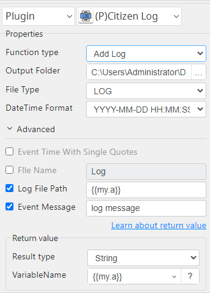

# Citizon Log

***The plugin manages the "Logging" for operations.***

## Citizon Log
| Item         |          Value           |
|--------------|:------------------------:|
| Icon         |  |
| Display Name |     **Citizon Log**      |

### Arun Kumar (arunk@argos-labs.com)

* [Email](mailto:arunk@argos-labs.com) 
 
## Version Control 
* [4.1014.1431](setup.yaml)
* Release Date: `October 14, 2022`

## Input (Required)
| Function type | Parameters                         | Output                            |
|---------------|------------------------------------|-----------------------------------|
| Initialize    | Output Folder                      | (Output File Path with datetime)  |
|               | File Type                          |                                   |
|               | FIle Name                          |                                   |
| Initialize    | Output Folder                      | (Output File Path with date only) |
|               | File Type                          |                                   |
|               | FIle Name without time             |                                   |
|               | FIle Name                          |                                   |
| Add Log       | Output Folder                      | (Output File Path )               |
|               | File Type                          |                                   |
|               | FIle Name (Initialize output file) |                                   |
|               | Event Log Message                  |                                   |

Note:-
1. Add Log FIle Name will be the output of Initialize.

## Return Value

### Normal Case
Description of the output result

## Return Code
| Code | Meaning             |
|------|---------------------|
| 0    | Success             |
| 99   | Exceptional case    |

## Output Format
You may choose one of 3 output formats below,

<ul>
  <li>String (default)</li>
  <li>CSV</li>
  <li>File</li>
</ul>  

## Parameter setting examples (diagrams)

## Operations

### Initialize:

### Add Log:

