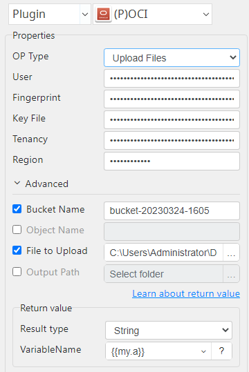
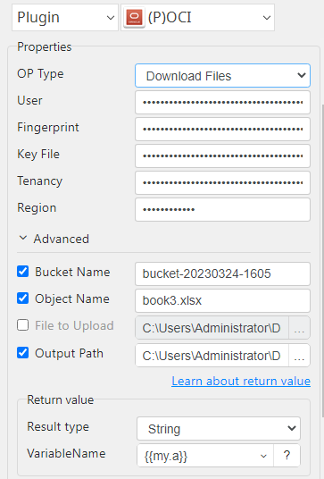

# OCI

***This plugin allows oci upload files to oci and download files from oci.***

## Box II
| Item         |       Value        |
|--------------|:------------------:|
| Icon         |    |
| Display Name |      **OCI**       |

## Arun Kumar (ak080495@gmail.com)

Arun Kumar
* [Email](mailto:ak080495@gmail.com) 
 
## Version Control 
* [4.329.923](setup.yaml)
* Release Date: `March 29, 2023`

## Primary Features
Upload and download the files from OCI.

## Get credentials from Oci console

1. Get Required Keys: https://docs.oracle.com/en-us/iaas/Content/API/Concepts/apisigningkey.htm

### Note:-
<ul>
    <li>Fingerprint must match to key file.</li>
    <li>Key File will be Private Key(.pam file).</li>
</ul>

## Input (Required)
| OP Type         | Selection      | Default Value          |
|-----------------|----------------|------------------------|
| Upload Files    | User           | (message success)      |
|                 | Fingerprint    |                        |
|                 | Key File       |                        |
|                 | Tenancy        |                        |
|                 | Region         |                        |
|                 | File to Upload |                        |
|                 | Bucket Name    |                        |
| Download Files  | User           | (Downloaded file path) |
|                 | Fingerprint    |                        |
|                 | Key File       |                        |
|                 | Tenancy        |                        |
|                 | Region         |                        |
|                 | Bucket Name    |                        |
|                 | Object Name    |                        |
|                 | Output Path    |                        |

## Return Value

### Normal Case
Description of output result

## Return Code
| Code | Meaning                      |
|------|------------------------------|
| 0    | Success                      |
| 99   | Exceptional case             |

## Output Format
You may choose one of 3 output formats below,

<ul>
  <li>String (default)</li>
  <li>CSV</li>
  <li>File</li>
</ul>  

## Parameter setting examples (diagrams)

## Operations

### Upload Files:

### Download Files:

